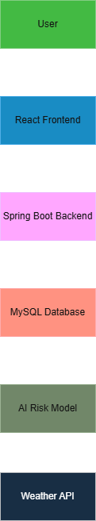

# GigShield – AI Powered Insurance for Delivery Workers

## About the Project

GigShield is an AI-powered parametric insurance platform designed for delivery workers such as Swiggy and Zomato partners.

The platform protects workers from income loss caused by external disruptions like heavy rain, extreme weather, pollution, or curfews.

It uses AI to calculate risk and automatically triggers insurance payouts when predefined conditions are met.

---

## Problem Statement

Delivery partners working for platforms like Swiggy and Zomato often lose income due to external disruptions such as heavy rain, extreme heat, pollution, or curfews.

Currently there is no insurance protection for their income loss.

---

## Proposed Solution

GigShield is an AI-powered parametric insurance platform that automatically compensates delivery workers when external disruptions prevent them from working.

---

## Target Persona

Food Delivery Partners (Swiggy / Zomato)

---

## Application Workflow

1. Worker registers on the platform  
2. AI calculates weekly premium based on location risk  
3. System monitors weather APIs  
4. If disruption occurs, claim is automatically triggered  
5. Worker receives instant payout  

---

## Parametric Triggers

- Rainfall > 40mm  
- Temperature > 45°C  
- Pollution AQI > 300  
- City curfew announcements  

---

## Weekly Premium Model

| Risk Level | Weekly Premium |
|-------------|---------------|
| Low Risk | ₹20 |
| Medium Risk | ₹35 |
| High Risk | ₹50 |

---

## Features

- User registration and login  
- AI-based weekly premium calculation  
- Real-time monitoring of external disruptions  
- Automatic claim triggering  
- Instant payout simulation  
- Dashboard for tracking earnings and claims  
- Fraud detection (planned)

---

## Tech Stack

Frontend: React  
Backend: Spring Boot  
Database: MySQL  
AI: Python (Scikit-learn)  
APIs: OpenWeather API  

---

## Project Structure

gigshield-ai-insurance  
│  
├── frontend  
├── backend  
├── ai-service  
├── docs  
└── README.md  

---

## How to Run the Project

### Frontend (React)
1. Navigate to frontend folder  
2. Install dependencies:  
   npm install  
3. Run the app:  
   npm start  

### Backend (Spring Boot)
1. Open backend folder in Eclipse/IntelliJ  
2. Run the Spring Boot application  

### AI Service (Python)
1. Navigate to ai-service folder  
2. Install dependencies:  
   pip install -r requirements.txt  
3. Run the model:  
   python risk_model.py  

---

## System Architecture

---

## Future Enhancements

- AI fraud detection  
- GPS validation for workers  
- Dynamic premium pricing  
- Real-time weather disruption alerts  

---

## Project Status

This project is currently in Phase-1 (Design & Planning). Implementation will be done in upcoming phases.

